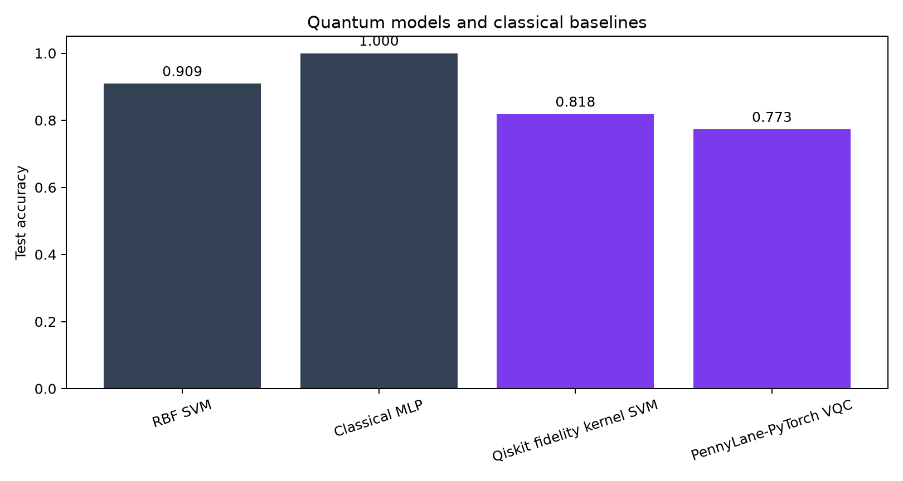
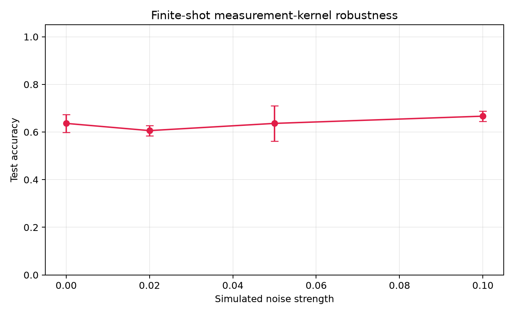
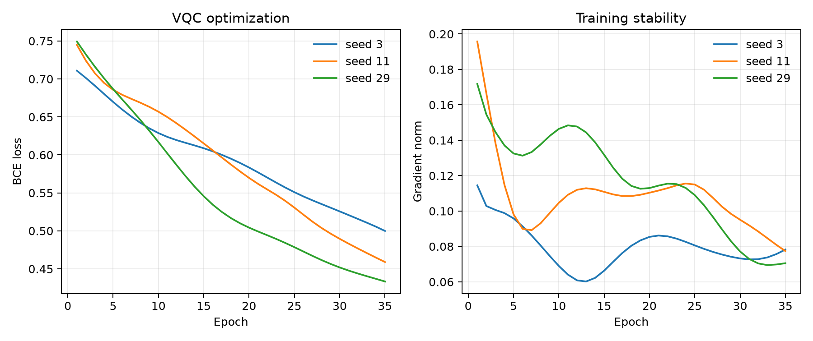
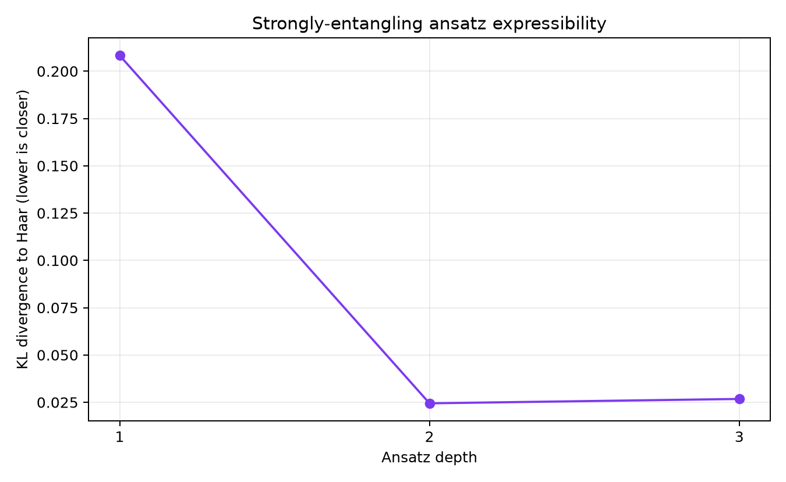

# Quantum ML and Variational Circuit Experiments

[](https://github.com/Sheehan007/quantum-ml-variational-circuits/actions/workflows/ci.yml)
[](https://www.python.org/)
[](https://www.ibm.com/quantum/qiskit)
[](https://pennylane.ai/)
[](LICENSE)

A reproducible research project for studying parameterized quantum circuits,
quantum feature maps, variational optimization, and hybrid quantum-classical
training. The suite compares quantum models with matched classical baselines and
measures the training instability, expressibility, finite-shot effects, and noise
sensitivity that constrain near-term quantum machine learning.

> **Scope:** every result in this repository is produced by a local simulator.
> The experiments are educational benchmarks, not evidence of quantum advantage
> and not measurements from quantum hardware.

## What is implemented

- **Qiskit fidelity-kernel SVM:** a data-reuploading feature map with local
  rotations and nearest-neighbor ZZ phases; exact statevector fidelities are used
  as a precomputed SVM kernel.
- **PennyLane + PyTorch VQC:** angle encoding, strongly-entangling variational
  layers, differentiable simulation, Adam optimization, and a classical linear
  readout.
- **Classical controls:** an RBF-kernel SVM and a compact tanh MLP trained on the
  identical split.
- **Training stability:** loss, held-out accuracy, and full gradient norm tracked
  over several initialization seeds.
- **Expressibility:** KL divergence between sampled ansatz-state fidelities and
  the analytic Haar-random fidelity distribution. Lower is more Haar-like.
- **NISQ stress test:** finite-shot sampling plus transparent depolarizing-mixture
  and symmetric readout-error proxies, repeated over seeds with mean and standard
  deviation reported.
- **Reproducibility:** fixed seeds, train-only preprocessing fits, captured package
  versions, CI, unit tests, CSV tables, JSON metadata, and publication-ready plots.

## Results from the quick profile

The repository includes a generated quick run under [`results/quick`](results/quick).
Re-run it with `make quick`; timestamps and stochastic results will be regenerated.









The exact tables are in `model_comparison.csv`, `noise_sweep.csv`,
`vqc_training.csv`, and `expressibility.csv`. Interpret small accuracy differences
carefully: this is a deliberately small synthetic benchmark, and a simulator does
not capture the full behavior of physical hardware.

## Installation

The recommended workflow uses [uv](https://docs.astral.sh/uv/):

```bash
git clone https://github.com/Sheehan007/quantum-ml-variational-circuits.git
cd quantum-ml-variational-circuits
uv sync --extra dev --python 3.11
```

Plain `pip` also works with a supported Python version:

```bash
python -m venv .venv
source .venv/bin/activate
python -m pip install -e '.[dev]'
```

## Run the experiments

```bash
# Small reproducible run used for the checked-in report
uv run qml-vqc --profile quick --output-dir results/quick

# Larger seed/sample sweep
uv run qml-vqc --profile full --output-dir results/full

# Change the root seed or use the convenience targets
uv run qml-vqc --profile quick --seed 123 --output-dir results/seed-123
make test
make lint
```

Each run writes:

```text
results/<run>/
├── summary.json             # configuration, versions, results, caveats
├── model_comparison.csv     # held-out accuracy and F1
├── noise_sweep.csv          # repeated finite-shot/noise results
├── vqc_training.csv         # per-epoch, per-seed diagnostics
├── expressibility.csv       # depth versus Haar KL divergence
├── model_comparison.png
├── noise_robustness.png
├── vqc_training.png
└── expressibility.png
```

## Experiment design

### 1. Controlled dataset

The binary two-moons problem is generated once and split with stratification.
Standardization and angle-range scaling are fit only on the training partition to
avoid test leakage. Every model receives the same examples.

### 2. Quantum feature kernel

For input \(x\), Qiskit prepares \(|\phi(x)\rangle\) with repeated single-qubit
rotations and data-dependent entangling phases. The ideal kernel is

\[
K(x_i, x_j) = |\langle \phi(x_i) | \phi(x_j) \rangle|^2.
\]

This positive-semidefinite Gram matrix is supplied to a classical SVM. The
finite-shot experiment separately uses a measurement-derived Bhattacharyya
kernel so that sampling and readout perturbations are explicit rather than hidden
behind an opaque backend.

### 3. Variational quantum classifier

PennyLane differentiates a simulator-backed circuit through PyTorch. The circuit
angle-encodes each sample, applies trainable `Rot` gates and ring entanglers, then
returns Pauli-Z expectation values to a classical readout layer. Several random
initializations expose optimizer variance that a single successful seed would
hide.

### 4. Expressibility and limitations

Random parameters are sampled at several circuit depths. Pairwise state
fidelities are compared with the exact Haar law using KL divergence. Greater
expressibility is not automatically better: circuits approaching random-state
behavior can also exhibit small gradients, and neither expressibility nor a
simulated benchmark implies a practical advantage.

The noise sweep models two specific effects:

1. mixing each ideal output distribution with the uniform distribution; and
2. independently flipping measured bits with a symmetric readout probability.

It does **not** model connectivity, scheduling, calibration drift, crosstalk,
leakage, or a particular device. Hardware claims require running circuits against
a calibrated backend and recording its provenance.

## Repository layout

```text
src/qml_vqc/
├── config.py                    # quick/full profiles
├── data.py                      # leakage-safe dataset pipeline
├── experiments.py               # orchestration and CLI
├── plotting.py                  # deterministic report figures
├── models/classical.py          # matched baselines
└── quantum/
    ├── qiskit_kernel.py          # feature maps and kernels
    ├── pennylane_vqc.py          # differentiable hybrid model
    └── expressibility.py         # Haar-distribution analysis
tests/                            # unit and gradient tests
scripts/run_experiments.py        # source-checkout convenience entry point
```

## Reproducibility checklist

- Python 3.11–3.13 is tested in CI.
- `uv.lock` records the complete resolved environment.
- Seeds are explicit for dataset generation, sampling, NumPy, and PyTorch.
- Test data never participates in preprocessing fits or model updates.
- Raw per-seed/per-epoch measurements remain available; plots are not the only
  source of results.
- `summary.json` records configuration and library versions alongside caveats.

## License

Released under the [MIT License](LICENSE).
